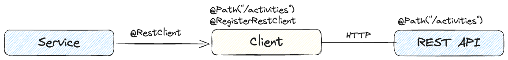

# Quarkus REST and REST Clients

## What is Quarkus REST?
Quarkus REST is a Jakarta REST implementation built on the Vert.x layer, making it fully *reactive* while being tightly integrated with Quarkus. Being reactive does not mean you cannot write imperative code in your REST endpoints. Each request is handled by an event loop (IO thread) and can invoke imperative code on a worker thread or reactive code on an IO thread (reactive route), thanks to the asynchronous nature of Vert.x and Netty, which power Quarkus.

## What is Quarkus REST Client?
A REST client is used for interacting with REST APIs. Quarkus REST Client is the MicroProfile REST Client implementation that is fully compatible with Quarkus REST. This means you can write both blocking and reactive clients, leveraging the full power of Quarkus.

In this post, I will focus on the client side and introduce three different ways to define and implement a REST client in Quarkus:
1. **CDI-based REST Client**: A type-safe REST client that is generated at build time.
2. **Programmatic REST Client from Microprofile**: A client that is created programmatically.
3. **Programmatic REST Client from Quarkus**: A client that is created programmatically at runtime using Quarkus' builder.

## Sample Use Case
Let's consider the following REST API that retrieves activity data:

```java
@GET
@Path("/api/activities")
public RestResponse<List<Activity>> getActivities();
```

This endpoint returns a list of activities, such as *Run - 30 mins*.

To access the API we need to define a REST client and a component that uses the client to fetch activities.
The following diagram shows the components and their interactions:


## Using a CDI-Based REST Client
By MicroProfile specification, we define a *Type-Safe REST Client* using Java interfaces:

```java
@Path("/activities")
@RegisterRestClient(configKey = "activities-simple")
public interface ActivityService {  
   @GET
   Uni<List<Activity>> getActivities();
}
```
Here, `@RegisterRestClient` is a marker annotation that registers a REST client at runtime. To fully leverage Quarkus' reactive capabilities, the non-blocking REST Client extension supports `CompletionStage` and `Uni` from Mutiny.

### Using the REST Client

To use this client in your code, inject it using `@RestClient`:

```java
@ApplicationScoped
public class ActivityResource {

    @RestClient
    ActivityService activityService;

    public Uni<List<Activity>> getActivities() {
        log.info("Fetching activities");
        return activityService.getActivities();
    }
}
```
### How the generated client looks like?
Quarkus' *Ahead-Of-Time Compilation (AOT)* generates the REST client implementation and places it into `generated-bytecode.jar`. The generated client might look like this (simplified version):

```java
public class ActivitySimpleService$$QuarkusRestClientInterface extends RestClientBase implements Closeable, ActivitySimpleService {
   final WebTargetImpl inputTarget;
   final WebTargetImpl baseTarget;
   private static final Method javaMethod1;
   private final HeaderFiller headerFiller1;

   public ActivitySimpleService$$QuarkusRestClientInterface(WebTarget var1, List var2) {
       WebTargetImpl var3 = (WebTargetImpl)var1;
       this.inputTarget = var3;
       WebTargetImpl var4 = this.baseTargetProducer(var3);
       ...
       ClassLoader var5 = Thread.currentThread().getContextClassLoader();
       Class var7 = Class.forName("io.crunch.rest.simple.ActivitySimpleHeadersFactory", false, var5);
       Annotation[] var8 = new Annotation[0];
       Object var9 = var6.instance(var7, var8).get();
       MicroProfileRestClientRequestFilter var10 = new MicroProfileRestClientRequestFilter((ClientHeadersFactory)var9);
       var4 = (WebTargetImpl)((Configurable)var4).register(var10);
       ...
       NoOpHeaderFiller var12 = NoOpHeaderFiller.INSTANCE;
       this.headerFiller1 = (HeaderFiller)var12;
   }
   
   public Uni<List<Activity>> getActivities() {
       WebTarget var1 = (WebTarget)this.target1;
       if (!ClientQueryParamSupport.isQueryParamPresent((WebTargetImpl)var1, "other-param")) {
           ArrayList var2 = new ArrayList();
           ((List)var2).add("other");
           var1 = (WebTarget)((WebTargetImpl)var1).queryParam("other-param", (Collection)var2);
       }

       String[] var3 = new String[]{"application/json"};
       Invocation.Builder var4 = var1.request(var3);
       Method var5 = javaMethod1;
       var4 = var4.property("org.eclipse.microprofile.rest.client.invokedMethod", var5);
       ...
       Class var10 = Class.forName("io.crunch.rest.shared.Activity", false, var8);
       var9[0] = (Type)var10;
       Object var11 = null;
       ParameterizedTypeImpl var12 = new ParameterizedTypeImpl((Type)List.class, var9, (Type)var11);
       GenericType var15 = new GenericType((Type)var12);

       try {
           ClassLoader var13 = Thread.currentThread().getContextClassLoader();
           Class var14 = Class.forName("org.jboss.resteasy.reactive.client.impl.UniInvoker", false, var13);
           return ((UniInvoker)var4.rx(var14)).method("GET", var15);
       } catch (ProcessingException var18) {
           ...
       }
   }
}
```

The injectable generated CDI-managed bean is a wrapper around the generated REST client:

```java
@ApplicationScoped
@RestClient
@Typed({ActivitySimpleService.class})
@Path("/activities")
public class ActivitySimpleService$$CDIWrapper extends RestClientReactiveCDIWrapperBase implements ActivitySimpleService {
    public ActivitySimpleService$$CDIWrapper() {
        ClassLoader var1 = Thread.currentThread().getContextClassLoader();
        Class var2 = Class.forName("io.crunch.rest.simple.ActivitySimpleService", false, var1);
        super(var2, "", "activities-simple", false);
    }

    @ClientQueryParam(
            name = "other-param",
            value = {"other"}
    )
    @Consumes({"application/json"})
    @Produces({"application/json"})
    public Uni<List<Activity>> getActivities() {
        return ((ActivitySimpleService)((RestClientReactiveCDIWrapperBase)this).getDelegate()).getActivities();
    }
}
```
With CDI, you only need to define the interface and apply annotations, avoiding boilerplate code. The generated class is marked with `@RestClient` and `@ApplicationScoped`, ensuring reuse across your application.

## Programmatic REST Client Creation

If you prefer to construct the REST client dynamically in your code, you have two options:
- **MicroProfile `RestClientBuilder`**
- **Quarkus `QuarkusRestClientBuilder`** (preferred for Quarkus applications)

### Example Using `QuarkusRestClientBuilder`

```java
public ActivityResource(String url) {
    ActivityService activityService = QuarkusRestClientBuilder.newBuilder()
        .baseUri(URI.create(url))
        .clientHeadersFactory(new ActivityHeadersFactory())
        .connectTimeout(100L, TimeUnit.MILLISECONDS)
        .readTimeout(100L, TimeUnit.MILLISECONDS)
        .httpClientOptions(new HttpClientOptions()
            .setMaxHeaderSize(1024)
            .setMaxPoolSize(10)
            .setKeepAlive(true)
            .setPipelining(false)
            .setConnectTimeout(1)
            .setIdleTimeout(10))
        .userAgent("Quarkus-Rest-Client")
        .property("some.config.key", "value")
        .queryParamStyle(QueryParamStyle.MULTI_PAIRS)
        .build(ActivityService.class);
}
```

**Note:** Most configurations can be overridden via properties or environment variables. However, due to the non-blocking nature of the calls, certain options (e.g., custom `ExecutorService`) are not supported.

**Note:** You do not need to specify the `@RegisterRestClient` annotation when using programmatic client creation.

If we compare the generated `QuarkusRestClientInterface` code - you can find it in the `generated-bytecode.jar` - with the previous one only the types are different, but the logic and the code sequence are the same.

> [!WARNING]
> I strongly recommend using different names (types) for the CDI-based and programmatic clients to avoid conflicts in the generated code!

### Why Use Programmatic Clients?

Using programmatic client creation allows you to centralize configuration in one place instead of relying on property-based customization.

A better approach is to use `@Producer` for REST client creation so that the client remains injectable via CDI.

## Execution Model: Reactive vs Blocking

If you test the example code from my GitHub repo, you will see different execution models depending on the API:

```java
@GET
@Path("non-blocking")
public Uni<List<Activity>> getActivities() {
   // Runs on event-loop thread
   return activityService.getActivities();
}
```

```java
@GET
@Path("blocking")
public List<Activity> getActivitiesBlocking() {
   // Runs on worker thread
   return activityService.getActivities().await().indefinitely();
}
```

In summary:
- **Non-blocking API (`Uni<T>`)** runs on the *event-loop* thread.
- **Blocking API (`T`)** moves execution to a *worker thread*.

## Conclusion

- Quarkus REST Client simplifies REST API interaction.
- Use **CDI-based REST clients** to minimize boilerplate.
- Use **programmatic client creation** for centralized configuration.
- Quarkus' AOT compilation optimizes performance by generating the necessary boilerplate code at build time.
- Choose between **blocking and reactive APIs** depending on your use case.

This approach ensures that you build high-performance, scalable applications leveraging Quarkus' reactive core.
